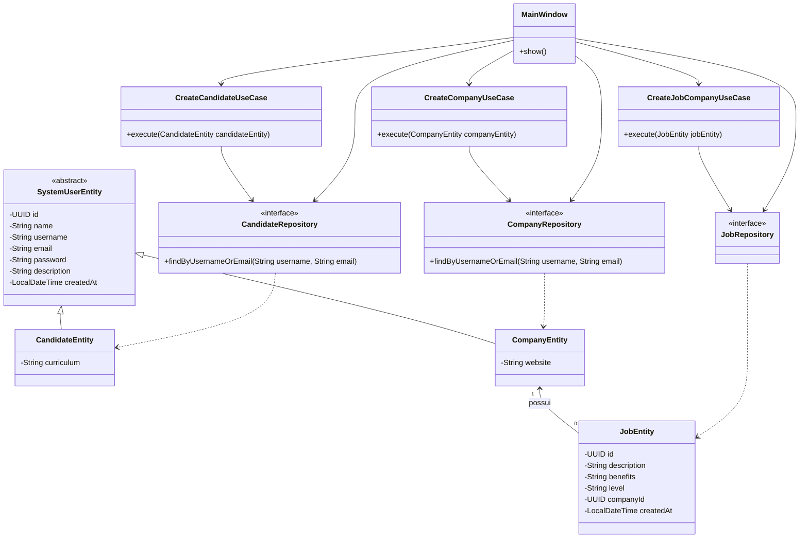

# Diagrama de Classes

Diagrama simplificado das principais classes do Sistema de Gestao de Vagas.

## Observacoes

- `SystemUserEntity` e uma classe abstrata porque representa dados comuns a candidatos e empresas, mas nao deve ser instanciada diretamente.
- `CandidateEntity` e `CompanyEntity` especializam `SystemUserEntity`.
- `JobEntity` se relaciona com `CompanyEntity`, pois uma vaga pertence a uma empresa.
- Os repositories sao interfaces, e suas implementacoes sao fornecidas pelo Spring Data JPA em tempo de execucao.
